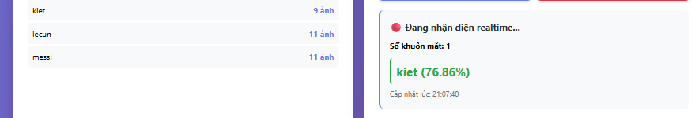

# 🎭 Face Recognition & Analysis System

A facial recognition and analysis system using Face Recognition and DeepFace with a modern web interface.


<p align="center">
  
  
  
  
</p>

## 🎬 GIF

<div style="text-align: center;">
  
</div>

<p style="text-align: center;"><em>Illustration of real-time facial recognition and analysis system</em></p>


## 📋 Project Description

This is a complete web system that allows:

### 1. **Face Recognition** 👤
- Register new user faces
- **Real-time recognition** from camera with bounding boxes
- Display name and confidence directly on video stream
- Manage registered user database
- Support multiple faces in one frame

### 2. **DeepFace Analysis** 🔍
- Age prediction
- Gender analysis
- Emotion recognition
- Ethnicity group identification

## 🏗️ System Architecture

The system uses 2 separate Anaconda environments:

```
├── face_recognition/          # Environment for face recognition
│   ├── face_recognition
│   ├── dlib
│   ├── numpy
│   ├── pillow
│   └── opencv-python
│
└── deepface_recognition/      # Environment for DeepFace analysis
    ├── deepface==0.0.96
    ├── opencv-python==4.12.0.88
    └── tf-keras
```

## 📁 Directory Structure

```
FaceRecognition_RealTime/
├── app.py                          # Main Flask web application
├── env_manager.py                  # Anaconda environment management script
├── face_recognition_service.py     # Face recognition service
├── deepface_service.py             # DeepFace analysis service
├── collect_data.py                 # Data collection tool (standalone)
├── requirements.txt                # Library list
├── README.md                       # This file
│
├── templates/                      # HTML templates
│   └── index.html                  # Main interface
│
├── static/                         # Static files (CSS, JS)
│   ├── style.css                   # Stylesheet
│   └── script.js                   # JavaScript logic
│
├── dataset/                        # Registered face data
│   ├── user1/
│   ├── user2/
│   └── ...
│
└── uploads/                        # Temporary folder for file uploads
```

## 🚀 Installation and Running

### Step 1: Install Anaconda/Miniconda

Ensure you have [Anaconda](https://www.anaconda.com/download) or [Miniconda](https://docs.conda.io/en/latest/miniconda.html) installed.

### Step 2: Clone or download project

```bash
git clone <repository-url>
cd FaceRecognition_RealTime
```

### Step 3: Automatic environment setup

The system can automatically set up the environment when running for the first time.

#### Method 1: Setup all environments in advance

```bash
python env_manager.py
```

#### Method 2: Setup each environment separately

```bash
# Setup Face Recognition environment
python env_manager.py face_recognition

# Setup DeepFace environment
python env_manager.py deepface_recognition
```

### Step 4: Run application

There are 3 ways to run the system:

#### ⭐ Method 1: Use `.bat` file (RECOMMENDED - Easiest!)

**On Windows:**

```bash
# Run batch file to automatically start all 3 services
start_services.bat
```

This file will automatically:
- ✅ Start **Face Recognition Service** (port 5001) in `face_recognition` environment
- ✅ Start **DeepFace Service** (port 5002) in `deepface_recognition` environment  
- ✅ Start **Main Web App** (port 5000) in current environment

After running, wait **30-60 seconds** for services to load models, then access: `http://localhost:5000`

**Note**: 
- The `.bat` file will open 3 separate terminal windows for each service
- To stop all services, close all 3 terminal windows or press `Ctrl+C` in each window

---

#### Method 2: Run each service manually

**Terminal 1 - Face Recognition Service:**
```bash
conda activate face_recognition
python face_recognition_service.py
```

**Terminal 2 - DeepFace Service:**
```bash
conda activate deepface_recognition
python deepface_service.py
```

**Terminal 3 - Main Web App:**
```bash
pip install flask requests  # If not installed
python app.py
```

Server will run at: `http://localhost:5000`

---

#### Method 3: Run only Main App (no real-time processing)

```bash
pip install flask requests
python app.py
```

**Note**: This method only runs the web interface. You need to set up the environment from the web interface when using features for the first time.

# Face Recognition & DeepFace Analysis App

A web application project integrating artificial intelligence for real-time facial recognition and deep facial attribute analysis (Deep Learning).
## 🚀 Main Features

### 1. Face Recognition (Realtime)
The system uses a webcam to detect and recognize the identity of registered users with high accuracy and displays the name along with confidence level.



### 2. DeepFace Analysis
Upload images for the model to analyze hidden facial indicators including:
- **Gender** (Gender)
- **Age** (Age)
- **Emotion** (Emotion)
- **Race** (Race)


## 🛠 Technologies Used
- **Backend:** Python (Flask)
- **Core AI:** `face_recognition`, `DeepFace`, `OpenCV`
- **Frontend:** HTML/CSS/JS (Webcam Integration)
- **Environment:** Multi-environment management with Anaconda
# Analysis of 2 Images

## 📊 Result Comparison Table

| **Component** | **Image 1: Face Recognition** | **Image 2: DeepFace Analysis** |
|----------------|------------------------------|-------------------------------|
| **Function** | Real-time recognition | Facial attribute analysis |
| **Input** | Webcam live stream | Static image (X-Ka ánh) |
| **Output** | Person name + confidence level | Gender, age, emotion, race |
| **Result** | `kiet` (76.86%) | • Gender: Male (99.64%)<br>• Age: 42<br>• Emotion: Neutral (96.68%)<br>• Race: Latino Hispanic (29.35%) |
| **Model used** | face_recognition (kNN classifier) | DeepFace (CNN ensemble) |
| **Accuracy** | Medium (76.86%) | High (99.64% gender, 96.68% emotion) |
| **Limitations** | • Depends on sample images<br>• Sensitive to lighting/angles | • Race only 29.35% confidence<br>• Age estimation may be inaccurate |
| **Applications** | Security Access Control | Demographic Analysis, Emotion AI |

## 🔍 Brief Analysis

### **Image 1 - Face Recognition:**
- Recognized 1 face in realtime
- Database has 3 people: kiet (9 images), lecun (11 images), messi (11 images)
- Result: recognized as "kiet" with 76.86% confidence
- UI displays: number of faces, name, %, timestamp

### **Image 2 - DeepFace Analysis:**
- Analyzed image "X-Ka ánh"
- Detailed results for 4 attributes:
  1. Gender: Male - very confident (99.64%)
  2. Age: 42 (estimated)
  3. Emotion: Neutral (96.68%)
  4. Race: Latino Hispanic (low confidence 29.35%)

## 🎯 Performance Evaluation

| **Metric** | **Face Recognition** | **DeepFace** |
|------------|----------------------|--------------|
| **Accuracy** | ⭐⭐⭐ (76.86%) | ⭐⭐⭐⭐⭐ (>96%) |
| **Speed** | ⭐⭐⭐⭐⭐ (realtime) | ⭐⭐⭐ (batch processing) |
| **Multitasking** | ⭐⭐ (only recognition) | ⭐⭐⭐⭐⭐ (4+ attributes) |
| **Easy Deployment** | ⭐⭐⭐⭐ | ⭐⭐⭐ |
## 📦 Installation
1. Install necessary libraries via Conda/Pip.
2. Run the Flask server file.
3. Access `localhost:5000`.
## 🎮 User Guide

### 1. Environment Check

When accessing the website, the "Environment Status" section will display:
- ✓ **Ready**: Environment has been fully set up
- ⚠ **Missing packages**: Environment exists but lacks libraries
- ✗ **Not installed**: Environment has not been created

Press the **"Set Up"** button to automatically install the missing environment.

### 2. Face Registration (Face Registration)

1. Switch to the **"👤 Face Recognition"** tab
2. Enter the username in the "Username" field
3. Press **"📷 Turn On Camera"**
4. Adjust face position within the frame
5. Press **"✓ Capture & Save"** multiple times to save multiple images (recommended: 5-10 images)
6. Press **"✕ Turn Off Camera"** when finished

> **Tip**: Capture from different angles (left, right, up, down) to improve recognition accuracy.

### 3. Face Recognition (Face Recognition)

1. In the **"👤 Face Recognition"** tab, right section
2. Press **"📷 Turn On Camera & Recognize"**
3. The system will automatically recognize in realtime every 1.5 seconds
4. Results displayed:
   - **Bounding boxes** (rectangular frames) around each face
   - **Name** and **accuracy (%)** on the frame
   - Green color: registered person ✅
   - Red color: Unknown ❌
5. Press **"✕ Turn Off Camera"** to stop

> **New feature**: Bounding boxes displayed directly on video stream!

### 4. DeepFace Analysis

1. Switch to the **"🔍 DeepFace Analysis"** tab
2. Press **"📷 Turn On Camera"**
3. Press **"🔬 Analyze"**
4. The system will display:
   - **Gender**: Male/Female with confidence level
   - **Age**: Predicted age
   - **Emotion**: Happy, sad, angry, etc.
   - **Race**: Asian, White, Black, etc.

## � Illustrative Images

<div align="center">
  
  <p><i>Web interface of the Face Recognition system</i></p>
</div>

<div align="center">
  
  <p><i>Face analysis with DeepFace</i></p>
</div>

## �🔧 Independent Data Collection Tool

File `collect_data.py` is a standalone tool for faster data collection:

```bash
# Edit configuration in the file:
FOLDER_PATH = "dataset/user_name"
IMG_SIZE = 300
SAVE_INTERVAL = False  # True = auto save, False = press 's' to save

# Run:
python collect_data.py
```

**Shortcuts:**
- `s`: Capture and save image
- `q`: Quit

## 🛠️ Troubleshooting

### Errors when running start_services.bat

#### Error: "timeout: invalid time interval '/t'"

**Cause**: You are using Git Bash or Linux command on Windows.

**Solution**:
- Run the `.bat` file from **Command Prompt (CMD)** or **PowerShell**, NOT from Git Bash
- Or double-click the `start_services.bat` file in File Explorer

#### Error: "conda: command not found" when running .bat

**Solution**:
1. Open **Anaconda Prompt** (search in Start Menu)
2. Navigate to the project folder:
   ```bash
   cd C:\Users\ADMIN\Desktop\FaceRecognition_RealTime
   ```
3. Run the batch file:
   ```bash
   start_services.bat
   ```
#### Error: Services not starting

**Solution**:
1. Ensure environment has been set up first:
   ```bash
   python env_manager.py
   ```
2. Check that ports (5000, 5001, 5002) are not occupied by other applications
3. Run each service manually (see Method 2) to see specific errors

### Error: "Conda is not installed"

**Solution**: Install [Anaconda](https://www.anaconda.com/download) or [Miniconda](https://docs.conda.io/en/latest/miniconda.html).

### Error: "Cannot access camera"

**Solution**:
- Check if camera is enabled
- Allow browser to access camera
- Ensure no other application is using the camera

### Error: "Face could not be detected"

**Solution**:
- Ensure face is within the frame
- Sufficient lighting
- Face looking directly at camera

### Error: "cannot write mode RGBA as JPEG"

**Cause**: Pasting PNG images with alpha channel (RGBA) from clipboard.

**Solution**: 
- ✅ Automatically fixed in code - RGBA images will be automatically converted to RGB
- If error persists, restart DeepFace service:
  ```bash
  # Stop old service (Ctrl+C)
  # Restart
  conda activate deepface_recognition
  python deepface_service.py
  ```

### Error installing dlib (Windows)

**Solution**:
```bash
# Install Visual C++ Build Tools first
# Or download dlib wheel from: https://github.com/jloh02/dlib/releases

conda install -c conda-forge dlib
```

### Error TensorFlow/GPU

**Solution**: DeepFace can run on CPU. If you want to use GPU:
```bash
conda install tensorflow-gpu
```

## 📊 System Requirements

- **OS**: Windows, macOS, Linux
- **Python**: 3.8 - 3.10
- **RAM**: Minimum 4GB (recommended 8GB+)
- **Camera**: Webcam or built-in camera
- **Browser**: Chrome, Firefox, Edge (latest version)

## 🔐 Security

- Face data is stored locally in the `dataset/` folder
- No data is sent externally
- Temporary images in `uploads/` are automatically deleted after processing

## 📝 Notes

- System works completely offline
- Data is stored locally
- DeepFace model can be customized if needed
- Supports multiple faces in one frame

## 🤝 Contribution

All contributions are welcome! Please create a Pull Request or Issue.

## 📄 License

MIT License

## 👨‍💻 Author

Face Recognition & Analysis System Project

## 🔗 References

- [Face Recognition Library](https://github.com/ageitgey/face_recognition)
- [DeepFace](https://github.com/serengil/deepface)
- [Flask Documentation](https://flask.palletsprojects.com/)
- [OpenCV Python](https://docs.opencv.org/4.x/d6/d00/tutorial_py_root.html)

---

**Note**: This project is for educational and research purposes only. Do not use for privacy infringement purposes.

## 🔗 Author's GitHub

<div align="center">


<p align="center">
  <a href="https://github.com/Kietnehi">
    
  </a>
</p>

<h3>🚀 Truong Phu Kiet</h3>

<a href="https://github.com/Kietnehi">
  
</a>


<br/><br/>

<p align="center">
  
  
</p>

<h3>🛠 Tech Stack</h3>
<p align="center">
  <a href="https://skillicons.dev">
    
  </a>
</p>

<br/>

<h3>🌟 Face Recognition Web Application Using DeepFace & FaceRecognition</h3>
<p align="center">
  <a href="https://github.com/Kietnehi/FaceRecognition_WEB">
    
    
    
  </a>
</p>
<!-- Dynamic quote -->
<p align="center">
  
</p>
<p align="center">
  <i>Thank you for visiting! Don’t forget to click <b>⭐️ Star</b> to support the project.</i>
</p>


</div>
